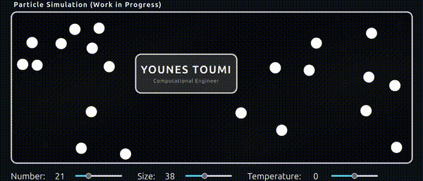

# Hi there 👋

I’m **Younes**, a **Computational Engineer** 💻 I specialize in numerical modeling, and scientific computing (on top of machine learning!). As a lifelong knowledge seeker, I’m dedicated to using my skills to solve (*complex*) problems and contribute to a better world! 🌍

# Currently Working on

### atomfetch: A small 3D-inspired atom simulation for the terminal!

  

  <a href="https://github.com/Younes-Toumi/atomfetch">
    [see corresponding repo]
  </a>

### A live particle collision simulation

  

  <a href="https://younes-toumi.github.io/younes-lab/">
    PLAY WITH THE SIMULATION →
  </a>

  <a href="https://github.com/Younes-Toumi/younes-lab">
    [or see corresponding repo]
  </a>

# Contact Info

[][youtube]

[][linkedin]

[][udemy]

[youtube]: https://www.youtube.com/@YounesLab
[udemy]: https://www.udemy.com/user/younes-abdeldjalil-toumi/
[linkedin]: https://www.linkedin.com/in/younes-a-toumi/
